# Patrón de identidad federada

## Problema:

En las situaciones donde una empresa requiera del uso de diversas aplicaciones para la realización de sus actividades. Sus empleados, posiblemente, necesitarán de varias credenciales de inicio para el acceso respectivo a cada una. 

Poseer varias credenciales puede aumentar la probabilidad de olvidar o perder los datos de algunas de estas, requerir de mayor supervisación de por cada empleado por la gran cantidad de cuentas y la ineficiencia en el desempeño de sus labores por el tiempo requerido para el inicio de sesión de cada aplicación.

## Solución:

Para evitar estos problemas, se puede implementar un mecanismo de autenticación que no este implentado en el código del sistema y que se derive a un proveedor de identificación confiable.

La solución se basa en el concepto de la arquitectura federada. Su funcionamiento es el de lograr que varios sistemas independientes trabajen juntos para el cumplimiento de un objetivo en común. La transmisión de información entre sistemas se da por medio de un API o por protocolos de comunicación.

Los proveedores de identificación pueden ser directorios corporativos como Microsoft Active Directory, los cuales son usados para manejar las cuentas y sus niveles de acceso dentro de una empresa; servicios de federación en sitio como Active Directory Federation Services, estos permiten el ingreso único de sesión para el acceso a varios aplicaciones y funciones remotas; servicios de tokens de seguridad como OAuth 2.0, los cuales permiten el acceso a las funciones de varios sistemas independientes según el nivel de acceso; y proveedores de identidad social como Google, son todos los servicios que permiten el uso de cuentas de una red social para identificar al usuario.

El siguiente gráfico explica como funciona:

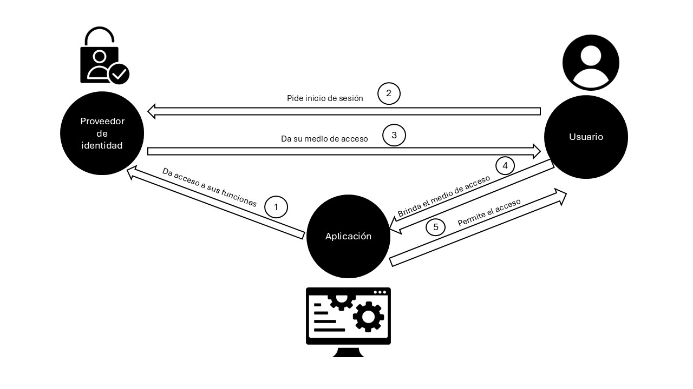

Primero se le brinda al proveedor de identidad los datos de acceso de los usuarios con sus niveles de accesos. Luego, en el proceso de inicio de sesión, el usuario ingresa sus credenciales de inicio para obtener el medio de ingreso (este puede ser un token, una autorización de un directorio o la validación de una red social). El flujo continua con la aceptación de los datos de inicio de sesión y brinda el medio del ingreso. Finalmente, el usuario da el medio de inicio a la aplicación y esta le permite el ingreso.

## Casos de aplicación:

- Manejo de acceso de las funcionalidades de aplicaciones, información y roles dentro de una empresa: una empresa con una gran cantidad de empleados podrá gestionar, con directorios corporativos, los permisos que cada uno de sus empleados puede tener con sus correos corporativos.

- Dar acceso a varios programas independientes: por medio de un ADFS, un usuario de una empresa podrá acceder, por medio de la página de la empresa, a varios servicios en la web. Estos pueden ser servicios SaaS y portales web.

- Comunicación entre empresas: este permite que una empresa pueda acceder a los programas propietarios de otra con el mismo inicio de sesión. Esta se da por medio de tokens de seguridad. Su método de funcionamiento es el que una empresa, que use el mismo medio de ingreso de token, obtendrá el token de un usuario exterior y podrá darle los permisos de uso que considere necesario sin necesitar crearle una cuenta.

- Uso de un proveedor de identidad social para acceder a servicios: Una universidad puede dar un correo institucional a sus estudiantes para que ellos puedan acceder a servicios a los que este se encuentre registrado. Estos pueden ser servicios de correo o servicios cloud.

## Aplicación en el trabajo grupal:

En el trabajo grupal, se podría usar un proveedor de identidad social para el inicio de sesión. Usar este método, nos permitirá que nuestro código no requiera de mantener las credenciales dentro de la base de datos y reducirá la complejidad de su desarrollo. Además, el implementar los servicios de Google nos dará la opción de poder vincularnos con sus servicios propios para reforzar la experiencia de usuario. Un ejemplo puede ser la integración de Gmail y Google Calendar en el proceso de compra; esto nos permitirá mandarles un mensaje de verificación de compra exitosa sin requerir pedir el ingreso de su correo y poder implementar un recordatorio de envío del paquete en Google Calendar.

## Código:

En este código se implementará un ejemplo del uso de proveedores de identidad social. Para la red social usada se uso Google, para el frontend se usó React y Node.js para el backend.

Primero se necesita configurar Google Cloud. Para esto se crea una cuenta en Google Cloud.
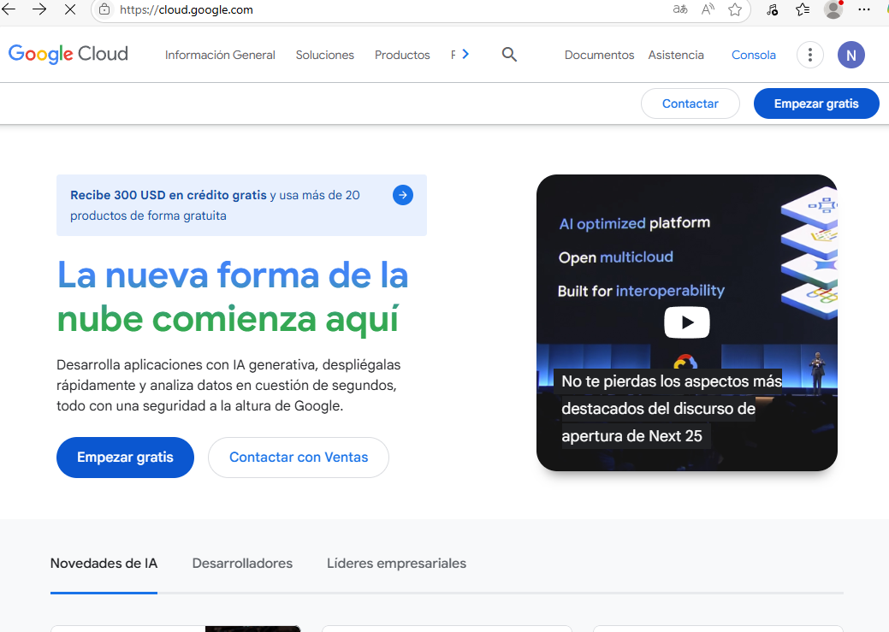

Luego de registrarnos, debemos de configurar la cuenta para usar el servicio de AOth. Este permite que las aplicaciones puedan registrarse con Google.
Primero se debe crear un nuevo proyecto. Para el trabajo se usará el nombre Proyecto Arquitectura.
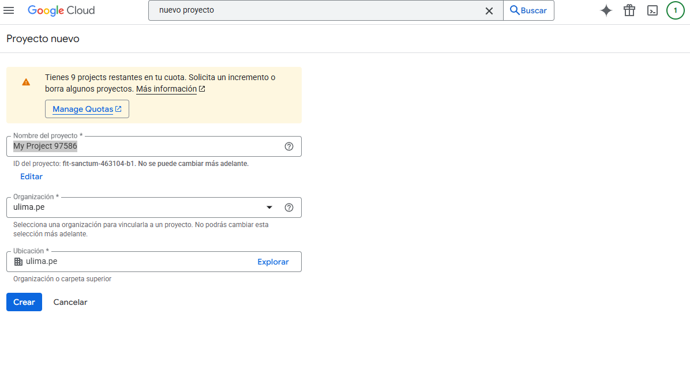

Luego tenemos que ir a APIs y servicios
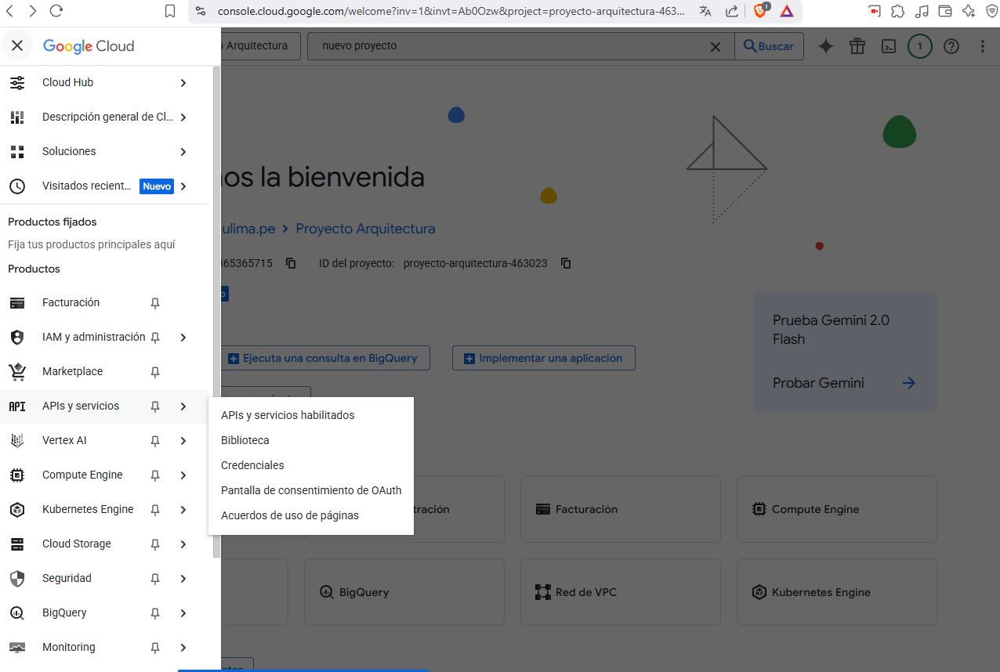

Luego se va a la pantalla de concentimiento de AOth
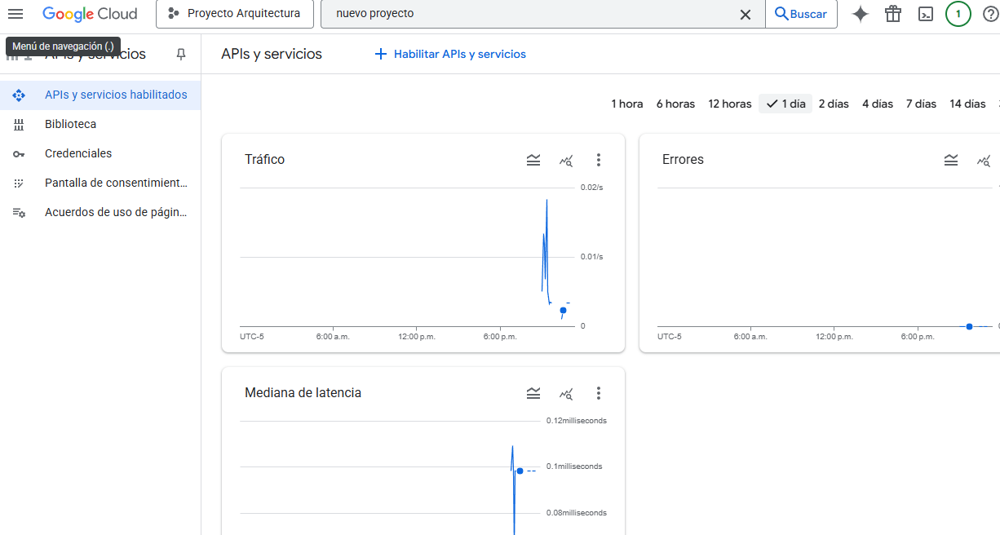

En esta pestaña vamos a clientes
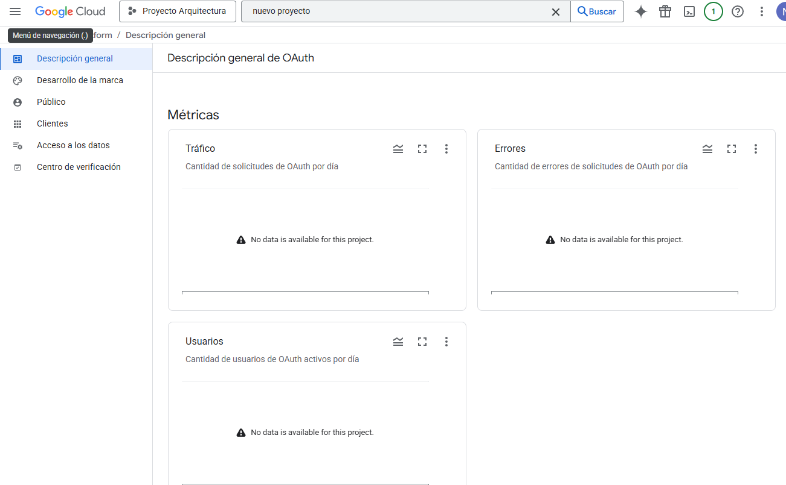

Creamos un cliente. Allí ponemos el tipo de aplicación, el nombre del cliente y el enlace de la página
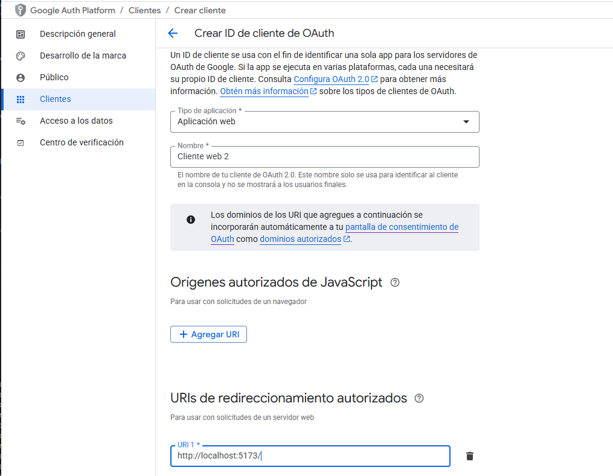

Luego regresamos a cliente y entramos a la pestaña del cliente creado. Allí copiamos la Id del cliente y el secreto del cliente. El secreto se verá la primera vez que ingresemos.
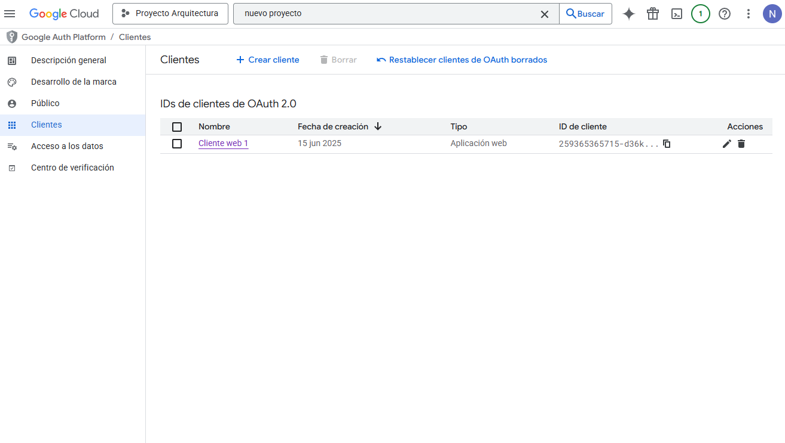
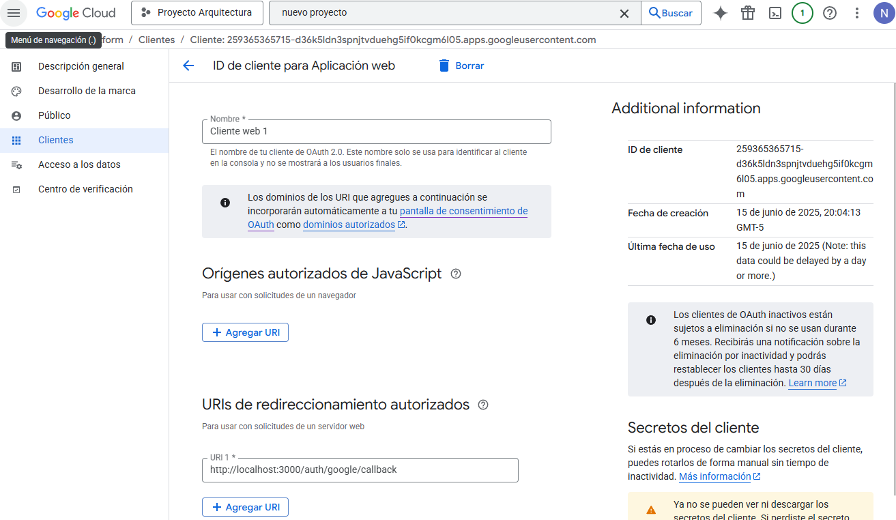
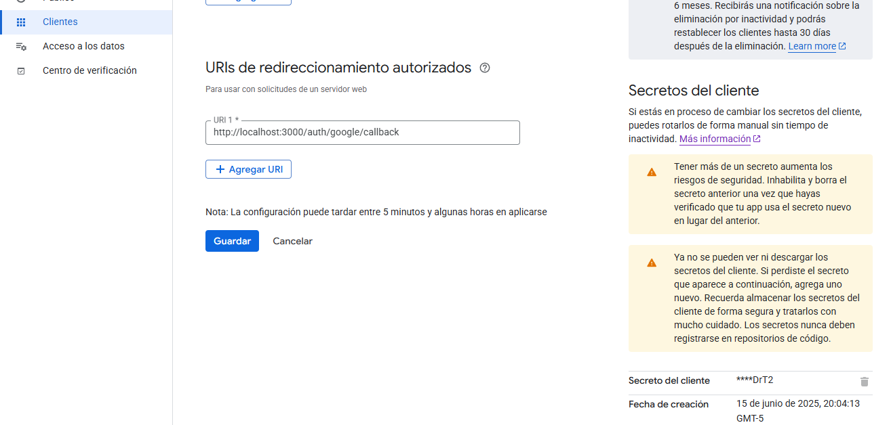

Con esto tenemos la configuración principal creada.

Luego de hacer esto, debemos de crear la carpeta de trabajo. Esta tendrá la siguiente estructura. La carpeta cliente tendrá el front-end, este será creado con React. La carpeta de servidor tendrá el backend, este fue realizado con Node.js. Empezaremos con servidor.
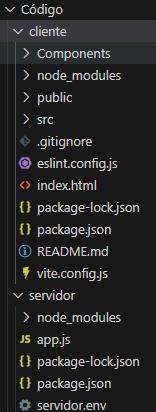

Allí se instalaron los siguientes módulos: express, passport, passport-google-oauth20, express-session, cors, dotenv.

- Express: manejará las rutas y las solicitudes HTPP.
- Passport: middleware de autenticación para Node.js. Soporta estrategias de autenticación como local, JWT, OAuth, etc.
- Passport-google-oauth20: permite usar la autenticación de Google. 
- Express-session: mantiene los datos de la sesión.
- Cors: permite la solicitud entre dominios. La comunicación entre el frontend y backend se genera gracias a esto.
- Dotnev: carga las variables de archivos .env.

En segundo lugar, se crearon los paquetes de Json del trabajo. En tercer lugar se creo el archivo servidor.env para tener los datos del servicio Cloud de Google: el cliente, el secreto y la clave del secreto (esta puede ser cualquier variable). Finalmente, se creo el backend; este se llamo app. Este obtendrá los datos de inicio de sesión y los dará al frontend. Para esta aplicación se usó el calendario de Google para demostrar que se pueden obtener los datos de cada servicio de este por medio de sus APIs propias.

Por parte del frontend. se utilizaron los componentes de botón de login y dashboard. El primer componente permitirá ingresar al dashboard por medio de los datos de Google y el segundo mostrará los datos del usuario y los futuros eventos del calendario.
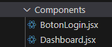

Finalmente, el código de aplicación permite redirigir a alguno de los componentes dependiendo de si se está iniciado (Dashboard) o no (BotonLogin).

El funcionamiento es simple, la aplicación permite que un usuario pueda usar el inicio de sesión de Google para su acceso, esto permitirá que se pueda mantener la sesión abierta mientras no se borren las cookies del programa. 

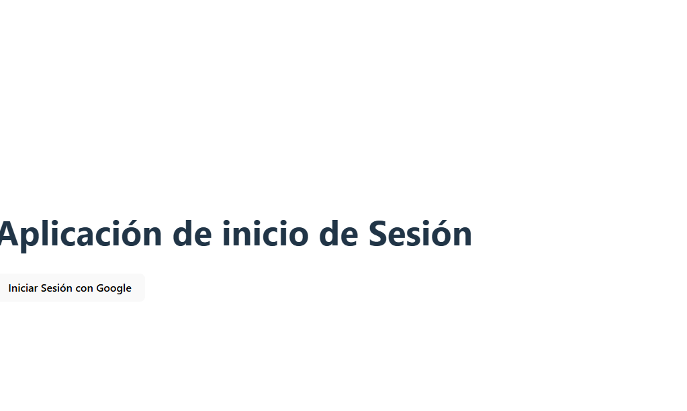

Al usar Google, cada aplicación relacionada al correo de Google podrá ser accedida desde esta aplicación. Un ejemplo que demostramos en el programa es la obtención de los eventos futuros del calendario, los cuales se mostrarán en el dashboard.
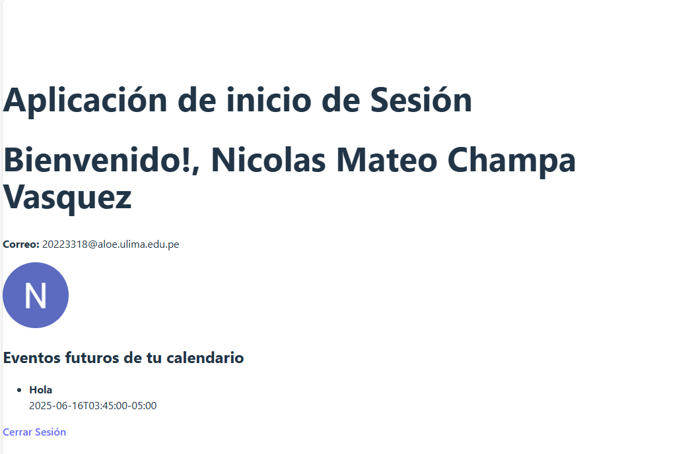

**Video:** https://youtu.be/9ZMoEIrcRYw