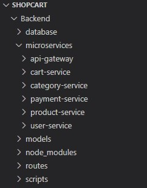
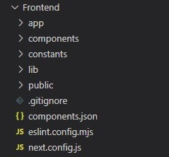

# 10.1. Catálogo de Aplicaciones Actualizado

## Frontend

La interfaz de usuario está desarrollada en Nextjs con TypeScript. Permite la interacción con diversas funcionalidades, como la gestión de productos, gestión de carritos, entre otros.

## Backend 
El servidor está construido con Node.js y Javascript, encargado de gestionar las solicitudes provenientes del frontend, incluyendo 6 microservicios como api-gateway,user-service,product-service,cart-service,payment-service y category-service.

| Aplicación       | Contenedor | Tecnología FE | Tecnología BE | BD            | Repositorio/Carpeta                                    |
|------------------|------------|---------------|---------------|---------------|--------------------------------------------------------|
| App web cliente  | Frontend   | Next.js       | Node.js       | PostgreSQL    | [https://github.com/carolinardlc/shopcart](https://github.com/carolinardlc/shopcart) |

## Estructura de carpetas

**Carpeta raíz "SHOPCART":**

- `Backend`:Microservicios (Puertos 5000-5005)        
- `api-gateway`:Gateway principal
- `user-service`:Usuarios y OAuth
- `product-service`:Productos y stock
- `cart-service`:Carritos
- `payment-service`:Pagos y órdenes
- `category-service`:Categorías
- `setup-environment.ps1`:Configuración automática
- `start-microservices.ps1`:Iniciar servicios
- `setup-database.sql`:Esquemas de DB
- `Frontend`:Aplicación Next.js (Puerto 3000)
- `app`:Páginas de la aplicación
- `components`:Componentes React
- `lib`:Servicios API
