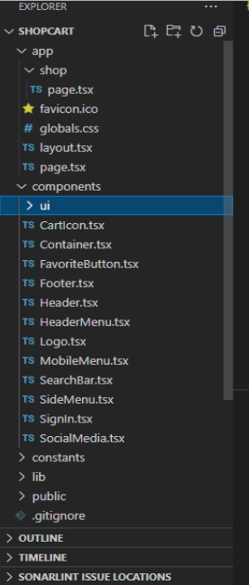

# 10.1. Catálogo de Aplicaciones Actualizado

## Frontend

La interfaz de usuario está desarrollada en Nextjs con TypeScript. Permite la interacción con diversas funcionalidades, como la gestión de productos, gestión de carritos, entre otros.

| Aplicación       | Contenedor | Tecnología FE | Tecnología BE | BD  | Repositorio/Carpeta                                    |
|------------------|------------|---------------|---------------|------|-------------------------------------------------------|
| App web cliente  | Frontend   | Next.js       | local         | -    | [https://github.com/carolinardlc/shopcart](https://github.com/carolinardlc/shopcart) |

## Estructura de carpetas

**Carpeta raíz "SHOPCART":**

- `/app`: Contiene las rutas y páginas principales.
- `/components`: Agrupa los componentes reutilizables como tarjetas de producto y botones.
- `/constants`: Define valores constantes como el listado de productos.
- `/lib`: Funciones de utilidad que pueden reutilizarse en varias partes del proyecto.
- `/public`: Archivos estáticos, como imágenes.
- `package.json`: Archivo con las dependencias y scripts del proyecto.
- `tsconfig.json`: Configuración de TypeScript.
- `next.config.ts`: Configuración personalizada de Next.js.
