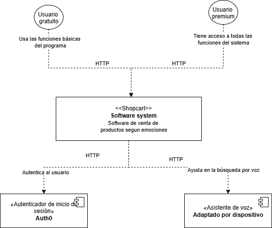

## 9.2. Iteración 1: Definir la estructura general del sistema

### 1. Objetivo de la iteración
Definir la estructura inicial y general de la tienda virtual innovadora **Shopcart**. Esta iteración contempla la selección de la arquitectura en capas, la autenticación federada con Google, y la organización de módulos para funcionalidades sociales, emocionales y de recomendación, garantizando seguridad, escalabilidad y mantenibilidad.

---

### 2. Elegir conceptos de diseño que satisfacen el driver seleccionado
**Diagrama de contexto**

| Código | Decisión de Diseño | Fundamentación |
|--------|--------------------|----------------|
| DEC-1 | Implementar Arquitectura Monolítica Modular | Permite desarrollo rápido (CRN01), despliegue simple (ESC-03), mantenimiento por dominio funcional (CRN10) y soporte a la escalabilidad futura mediante desacoplamiento interno. |
| DEC-2 | Usar React para frontend y Node.js con Express para backend | React ofrece un ecosistema maduro (CON02), mientras Node.js con Express permite una API REST robusta y modular (CON03), ideal para manejar sesiones y servicios distribuidos. |
| DEC-3 | Aplicar autenticación federada con OAuth 2.0 usando Google | Reducción de riesgos de seguridad (ESC-01), gestión eficiente de usuarios (CU01), integración con servicios de Google Cloud como Calendar y simplificación del registro/login. |
| DEC-4 | Utilizar Passport.js como middleware de autenticación | Permite mantener sesiones activas con seguridad (CRN07) y soportar múltiples estrategias de autenticación si se desea escalar hacia otros IdPs en el futuro. |
| DEC-5 | Separar módulos funcionales por dominio | Esta separación garantiza claridad, mantenibilidad (CRN10) y asignación precisa de responsabilidades para funcionalidades como emociones, carrito colaborativo y narrador de compra. |
| DEC-6 | Integrar dotenv para manejo seguro de variables de entorno | Mejora la seguridad del sistema (ESC-01), especialmente al manipular CLIENT_ID, CLIENT_SECRET y claves API sensibles. |
| DEC-7 | Usar librería cors para comunicación entre frontend y backend | Permite interoperabilidad entre dominios durante desarrollo y despliegue distribuido (CON06). |
| DEC-8 | Implementar servicios cloud con Google Cloud Platform (GCP) | Proporciona autenticación OAuth 2.0, escalabilidad y acceso a APIs complementarias como Google Calendar (CU04), fortaleciendo la experiencia inmersiva de Shopcart. |

---

### 3. Instanciar elementos de Arquitectura, asignar responsabilidades y definir interfaces

| Código | Decisión de Diseño | Fundamentación |
|--------|--------------------|----------------|
| DEC-9 | Módulo de Autenticación y Usuarios con Google OAuth | Provee registro y login seguros, sincronización con servicios Google y gestión de sesión con Passport.js. |
| DEC-10 | Módulo de Emociones y Recomendación Inteligente | Registra emociones del usuario para personalizar productos y aplicar aprendizaje federado. |
| DEC-11 | Módulo de Carrito Colaborativo y Social | Permite añadir productos compartidos, invitaciones sociales y edición colaborativa del pedido. |
| DEC-12 | Módulo de Narrador de Compra y Visualizador Emocional | Crea una experiencia inmersiva y guiada por las emociones del usuario. |
| DEC-13 | Módulo de Recompensas y Perfil Personalizado | Gamifica la experiencia de compra con puntos, logros y elementos desbloqueables. |
| DEC-14 | Módulo de Backoffice y Administración | Permite gestionar productos, emociones registradas, usuarios y métricas de recomendación. |

---

### 4. Registrar decisiones de diseño

#### 1. Módulo de Autenticación y Usuarios

- **Responsabilidades**: Login/registro con Google, gestión de sesiones, perfiles de usuario.
- **Tecnologías**: Node.js + Express + Passport.js + Google OAuth + dotenv
- **Patrones**: Stateless Auth con sesiones persistentes, manejo de entorno seguro, OAuth flow
- **Casos de uso**: CU01-CU03

#### 2. Módulo de Emociones y Recomendación

- **Responsabilidades**: Captura de emociones, feedback visual, entrenamiento federado, sugerencias personalizadas.
- **Tecnologías**: React, TensorFlow.js (cliente), SQLite local + Python (entrenamiento), Express API
- **Patrones**: Aprendizaje Federado, Agregación de modelos locales, Edge Computing
- **Casos de uso**: CU04-CU07

#### 3. Módulo de Carrito Colaborativo

- **Responsabilidades**: Gestión de pedidos compartidos, roles (admin, editor), sincronización entre usuarios.
- **Tecnologías**: React + Express + WebSockets (opcional), LocalStorage
- **Patrones**: Realtime Collaboration, Broadcast Pattern, Cache con persistencia temporal
- **Casos de uso**: CU08-CU11

#### 4. Módulo de Narrador de Compra

- **Responsabilidades**: Relato visual/voz de la compra, conexión emocional, navegación interactiva.
- **Tecnologías**: React + Three.js o Lottie, Google Text-to-Speech API (opcional)
- **Patrones**: Narración guiada, Visual Storytelling
- **Casos de uso**: CU12-CU14

#### 5. Módulo de Recompensas

- **Responsabilidades**: Puntos por interacción emocional, desbloqueo de temas, medallas y logros.
- **Tecnologías**: React + Node.js + Local DB
- **Patrones**: Sistema de niveles, Observer Pattern, UI reactiva
- **Casos de uso**: CU15-CU17

#### 6. Módulo Backoffice y Admin

- **Responsabilidades**: Administración de catálogo, usuarios, emociones y métricas del sistema.
- **Tecnologías**: Node.js + Express + Google Cloud Storage + Dashboard Admin
- **Patrones**: CRUD extendido, Gestión de roles y permisos
- **Casos de uso**: CU18-CU21

---

### 5. Patrones y Tácticas Aplicadas por Atributo de Calidad

**Disponibilidad**:
- Uso de servicios cloud como GCP (DEC-8)
- Separación de módulos por capas con Express Router

**Rendimiento**:
- OAuth externo reduce carga interna (DEC-3)
- Aprendizaje federado distribuye la carga de entrenamiento (DEC-10)

**Seguridad**:
- Autenticación delegada con OAuth 2.0 (DEC-3)
- Uso de dotenv para ocultar credenciales (DEC-6)

**Mantenibilidad**:
- Modularidad por dominio (DEC-5)
- Middleware reutilizable con Passport.js (DEC-4)

**Interoperabilidad**:
- Uso de CORS (DEC-7)
- Integración con APIs externas (Google Cloud, Calendar, OAuth)

---

### 6. Análisis del diseño actual

| Elemento | Abordaje |
|----------|----------|
| CU01-CU03 | ✔ | DEC-3, DEC-4, DEC-9 |
| CU04-CU07 | ✔ | DEC-10 |
| CU08-CU11 | ✔ | DEC-11 |
| CU12-CU14 | ✔ | DEC-12 |
| CU15-CU17 | ✔ | DEC-13 |
| CU18-CU21 | ✔ | DEC-14 |
| ESC-01 | ✔ | DEC-3, DEC-6 |
| ESC-02 | ✔ | DEC-5 |
| ESC-03 | ✔ | DEC-1 |
| ESC-04 | ✔ | DEC-8 |
| ESC-06 | ✔ | DEC-2, DEC-7 |
| CRN01 | ✔ | DEC-1, DEC-5 |
| CRN02 | ✔ | DEC-10 |
| CRN06 | ✔ | DEC-2 |
| CRN07 | ✔ | DEC-3 |
| CRN10 | ✔ | DEC-5 |

---

### 7. Resumen de la Iteración 1

Esta iteración ha logrado:

- Definir la arquitectura monolítica modular para Shopcart
- Seleccionar un stack moderno con React, Node.js, OAuth y Express
- Diseñar 6 módulos clave para experiencias inmersivas, sociales y emocionales
- Establecer patrones de seguridad, mantenibilidad, interoperabilidad y rendimiento
- Integrar Google OAuth y Google Cloud para autenticación y servicios externos
- Sentar las bases para implementar aprendizaje federado en el cliente

---

### 8. Infraestructura Esperada

- Arquitectura monolítica modular con Express Router
- React para interfaz y experiencia emocional
- Node.js + Express como backend principal
- Passport.js + OAuth 2.0 para autenticación federada
- Dotenv + cors para seguridad y conexión entre dominios
- SQLite + Python para simular entrenamiento federado
- Google Cloud Platform para autenticación, APIs y almacenamiento

